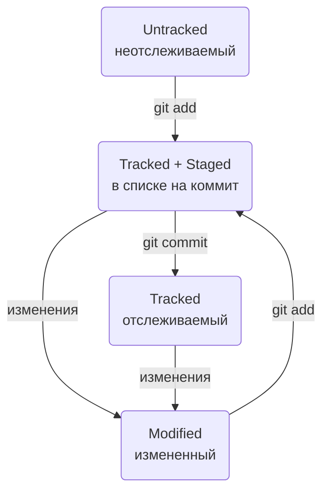

# Персональная шпаргалка по Git

---  
  
## Основные комманды  
  
git init - создание локального репозитория в текущей директории  
  
git status - запрос статуса репозитория  
  
git add _имя файла_ - подготовка к коммиту определнного файла  
  
git add --all - подготовка к коммиту всех файлов  
  
git restore --staged _имя файла_ - исключение файла из списка на коммит  
  
git restore --staged . - исключение из списка на коммит всех файлов текущей папке  
  
git restore _имя файла_ - откат определенного файла до последней сохраненной в Git версии (через коммит или git add)  
  
git commit -m "_сообщение_" - коммит  
  
git commit --amend --no-edit - исправить последний коммит без изменения сообщения  
  
git commit --amend -m "_исправленное сообщение_" - исправить последний коммит с изменением сообщения  
  
git reset --hard _хэш коммита_ - откат к раннему коммиту, чей хэш передается в команду  
  
git diff - вывод внесенных изменений в файл (только в состоянии modified)  
  
git diff --staged - вывод внесенных изменений в файл после git add  
  
git log - история коммитов полная  
  
git log -- oneline - сокращенная история коммитов  
  
git push -u origin _ветка_ - первая загрузка в удаленный репозиторий  
  
git push - загрузка в удаленный репозиторий  
  
git remote add origin _копия строки из поля ssh_ - привязка локатьного репозитория к удаленному  
  
git remote -v - посмотреть привязку удаленного к локальному  
  
## Типовые шаблоны действий
  
### Настройка  
- git config --global user.name "Имя пользователя"  
- git config --global user.email _почта пользователя_  
- git config --list (проверка заданных настроек, опционально)  

### Создание локального репозитория  
- git init  
- git status (опционально)  

### Добавление коммита в локальный репозиторий  
- git add --all  
- git commit -m "_краткое описание коммита_"  
  
### Генерация SSH-ключа и привязка его к GitHub  
- проверить наличие ключей (_домашняя директория/.ssh_), и если есть - удалить  
- ssh-keygen -t ed25519 -C _"электронная почта, к которой привязан аккаунт на GitHub"_  
- указать место хранения ключей (можно оставить по умолчанию), нажать Enter  
- ls -a ~/.ssh (проверка что сгенерировались, опционально)  
- открыть файл публичного ключа id_ed25519.pub и скопировать содержимое  
- перейти в свой профиль на GitHub - Settings - SSH and GPG keys  
- нажать кнопку *New SSH key* задать настройки:  
 * Title - _заголовок, название ключа_  
 * Key type - Authentication Key  
 * Key - вставить скопированное ранее содержимое публичного ключа  
- нажать кнопку Add SSH key  
- ssh -T git@github.com (проверка правильности ключа)  
    
### Создание удаленного репозитория  
- профиль GitHub - вкладка *Repositories* - кнопка *New*  
  
### Привязка удаленного репозитория к локальному
- git remote add origin _копия строки из поля ssh_
- git push -u origin master  
  
### Добавление коммита в удаленный репозиторий  
- добавляем коммит в локальный репозиторий  
- git push  
  
## Статусы файлов  
  
**untracked** - неотсеживаемый. Git видит файл но не следит заизменениями в нем.  
**tracked** - отслеживаемый. Git следит за изменениями в файле. В явном виде не отображается. Все файлы имющие нижеперечисленные состояния явяются tracked  
**staged** - подготовленный. Файл включен в список файлов, которые войдут в коммит.  
**modified** - измененный. Файл имеет изменения относитально последней сохраненной в Git версии.  
  
### Жизненный цикл файла  

