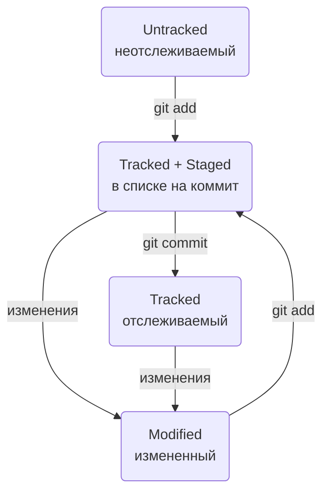

# Персональная шпаргалка по Git

---  
  
## Основные комманды  
  
git init - создание локального репозитория в текущей директории  
  
git clone _копия строки из поля ssh клонируемого репозитория_ - клонирование удаленного репозитория на свой ПК. Клонированный репозиторий автоматически привязывается к удаленному.  
  
git status - запрос статуса репозитория  
  
git status --ignored - отображение статуса включая игнорируемые файлы  
  
git add _имя файла_ - подготовка к коммиту определнного файла  
  
git add --all - подготовка к коммиту всех файлов  
  
git add -f _имя файла_ - включение в список на коммит игнорируемого файла  
  
git restore --staged _имя файла_ - исключение файла из списка на коммит  
  
git restore --staged . - исключение из списка на коммит всех файлов текущей папке  
  
git restore _имя файла_ - откат определенного файла до последней сохраненной в Git версии (через коммит или git add)  
  
git commit -m "_сообщение_" - коммит  
  
git commit --amend --no-edit - исправить последний коммит без изменения сообщения  
  
git commit --amend -m "_исправленное сообщение_" - исправить последний коммит с изменением сообщения  
  
git reset --hard _хэш коммита_ - откат к раннему коммиту, чей хэш передается в команду  
  
git diff - вывод внесенных изменений в файл (только в состоянии modified)  
  
git diff --staged - вывод внесенных изменений в файл после git add  
  
git diff _хэшА_ _хэшВ_ - вывод изменений между коммитами  
  
git diff _ветка1_ _ветка2_ - вывод изменений между ветками. Можно совмещать например: git diff HEAD main - разница между последним коммитом и веткой main  
  
git diff master master~2 - суффикс навигации ~ позволяет в упрощенном виде ссылаться на N-количество коммитов назад. В данном примене сравнивается последний коммит в ветке master со вторым коммитом с конца(пред пред последний)    
  
git log - история коммитов полная  
  
git log -- oneline - сокращенная история коммитов  
  
git push -u origin _ветка_ - первая загрузка в удаленный репозиторий. Выполняется для каждой новой ветки.  
  
git push - загрузка в удаленный репозиторий  
  
git push --force - принудительная загрузка в удаленный репозиторий. Игнорирует конфликты, все что несовместимо перезаписывает (не рекомендуется)  
  
git pull - загрузка изменений из удаленного репозитория  
  
git remote add origin _копия строки из поля ssh_ - привязать локатьный репозиторий к удаленному  
  
git remote -v - посмотреть привязку удаленного к локальному  
  
git remote rm origin - отвязать локальный репозиторий от удаленного  
  
git branch - посмотреть список веток в локальном репозитории. Текущая ветка отмечена символом \*  
  
git branch -a - посмотреть список всех веток, как в локальном, так и в удаленном репозитории  
    
git branch _название ветки_ - создание новой ветки  
  
git branch -d _название ветки_ - удаление ветки после слияния. Выполнится только если ветка полностью стала частью другой. Для удаления без проверки этого условия передать флаг -D (не рекомендуется)  
  
git checkout _название ветки_ - переключиться на ветку  
  
git checkout -b _название ветки_ - создать новую ветку и сразу переключиться на нее  
  
git merge _название ветки_ - объединение веток. Сначала нужно перейти на ветку, в которую вносятся изменения, затем передать этой команде название верки откуда взять эти изменения.  
  
git merge --no-ff _название ветки_ - объединение веток с отключением fast-forward. Коммиты из вливаемой ветви не включаются в основную, а в место этого образуется один merge-коммит  
  
git mv _старое имя_ _новое имя_ - переименование папки  
  
## Типовые шаблоны действий
  
### Настройка  
- git config --global user.name "Имя пользователя"  
- git config --global user.email _почта пользователя_  
- git config --list (проверка заданных настроек, опционально)  

### Создание локального репозитория  
- git init  
- git status (опционально)  

### Добавление коммита в локальный репозиторий  
- git add --all  
- git commit -m "_краткое описание коммита_"  
  
### Генерация SSH-ключа и привязка его к GitHub  
- проверить наличие ключей (_домашняя директория/.ssh_), и если есть - удалить  
- ssh-keygen -t ed25519 -C _"электронная почта, к которой привязан аккаунт на GitHub"_  
- указать место хранения ключей (можно оставить по умолчанию), нажать Enter  
- ls -a ~/.ssh (проверка что сгенерировались, опционально)  
- открыть файл публичного ключа id_ed25519.pub и скопировать содержимое  
- перейти в свой профиль на GitHub - Settings - SSH and GPG keys  
- нажать кнопку *New SSH key* задать настройки:  
 * Title - _заголовок, название ключа_  
 * Key type - Authentication Key  
 * Key - вставить скопированное ранее содержимое публичного ключа  
- нажать кнопку Add SSH key  
- ssh -T git@github.com (проверка правильности ключа)  
    
### Создание удаленного репозитория  
- профиль GitHub - вкладка *Repositories* - кнопка *New*  
  
### Привязка удаленного репозитория к локальному
- git remote add origin _копия строки из поля ssh_
- git push -u origin master  
  
### Добавление коммита в удаленный репозиторий  
- добавляем коммит в локальный репозиторий  
- git push  
  
### Pull request рекомендованная последовательность  
- перейти в главную ветру и подтянуть последние изменения git checkout main && git pull  
- объеденить свою ветку с главной git checkout _моя ветка_ && git merge main  
- при возникновении конфликтов на предыдущем шаге - устранить их  
- git push -u origin _моя ветка_  
- создать pull request на GitHub  
- дождаться "Апрува" от ревьюера (если есть), и нажать Merge  
- обновить локальный репозиторий git checkout main && git pull  
  
## Статусы файлов  
  
**untracked** - неотсеживаемый. Git видит файл но не следит заизменениями в нем.  
**tracked** - отслеживаемый. Git следит за изменениями в файле. В явном виде не отображается. Все файлы имющие нижеперечисленные состояния явяются tracked  
**staged** - подготовленный. Файл включен в список файлов, которые войдут в коммит.  
**modified** - измененный. Файл имеет изменения относитально последней сохраненной в Git версии.  
  
### Жизненный цикл файла  

  
## Игнорирование файлов .gitignore  
.gitignore - файл для записи правил игнорирования файлов (без txt или какого-либо расширения). Обычно помещается в корневой католог репозитория. Для того чтобы заработал нужно его закоммитить.  
Правила из .gitignore применяются только к новым (untracked) файлам. Если файл уже попал в git add или был закоммичен, то правила игнорирования на него не распространяются  
Удобно создать через touch .gitignore  
  
\# - символ начала комментирования. Если строка начинается на \#, то она не будет учитываться  
_filename_ - директивное игнорирование файла по его имени. В такой записи будет игнорироваться и в корне и во всех вложенных папках репозитория  
\*.jpeg - игнорирование файлов определенного расширения. Символ \* соответствует любой строке, включая пустую.  
docs/\*/tmp - игнорировать все файлы "tmp" во всех подпапках папки docs  
file?.txt - игнорирование файлов с указанным именем, где в место символа ? указан любой другой символ. 1 ? - 1 символ включая пустой  
file\[0-2\].txt - как ? только не любой символ, из списка перечисленного в \[\]. Символы можно просто перечислить \[abc\] или задать через - \[a-c\]  
/file.txt - указание на корневой каталог. Файл с таким именем будет игнорироваться только в корневом катологе  
build/ - игнорирование всей папки с определенным именем  
docs/\*\*/tmp - парные звездочки соответствуют любому количеству папок  
\!doge.jpeg - инферсия правила. Символ \! позволяет инвертировать любое правило  
